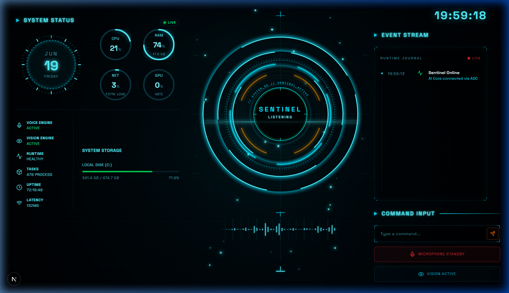

# 🌌 S.E.N.T.I.N.E.L — Spatial AI Operating System

Sentinel is a next-generation, high-performance intelligent agent operating system designed to plan, execute, and remember complex user interactions. It features a stunning, futuristic sci-fi HUD dashboard combined with a low-latency, native **Audio-to-Audio** pipeline powered by the Gemini Live API.



---

## 🚀 Key Features

* **🎙️ Low-Latency Native Audio-to-Audio**: Direct microphone capture via browser `AudioWorkletNode` streaming raw PCM binary frames over WebSockets. The backend downsamples incoming frames in a thread-safe, bounded queue to 16kHz and pipes them directly to the Gemini Live session, achieving near-zero latency conversation without intermediate text transcriptions.
* **🪐 Immersive Sci-Fi HUD Dashboard**: A premium, responsive interface featuring dynamic rotating orbitals, concentric arcs, real-time particle fields, and glowing gauges showing system CPU, memory, network speed, and disk storage metrics.
* **👁️ Continuous OS-level Vision**: Background loop that captures the primary display, runs frame-diff analysis, and streams visual inputs directly to the Gemini Live session to let the AI "see" your screen.
* **🛠️ Native Tool Execution**: Empowered with OS-level tools allowing Sentinel to inspect directory trees, read/write files, simulate mouse/keyboard inputs, query weather, search the web, manage reminders, and track background tasks.
* **🧠 Persistent categorised Memory**: Long-term categorical memory subsystem using Gemini to analyze, extract, and format key user facts, preferences, relationships, and wishes into structured long-term storage.

---

## 📂 Codebase Structure

```
├── backend/                  # FastAPI Python Backend Service
│   ├── app/
│   │   ├── api/              # WebSocket & System Stats endpoints
│   │   ├── Sentinel/         # Core features and OS settings
│   │   ├── config.py         # App configurations & AI instructions
│   │   ├── main.py           # Lifespan handlers & app initialization
│   │   └── services/         # Logger, Screen capture, & Vertex AI Services
│   └── requirements.txt      # Python dependencies
│
└── frontend/                 # React & Next.js Tailwind UI (TypeScript)
    ├── app/                  # Main layout and page views
    ├── public/               # PCM Processor AudioWorklet & static assets
    └── src/
        ├── components/       
        │   ├── core/         # Orbitals, Backdrop, Grid, Waveform elements
        │   ├── panels/       # System Status, Event Stream, Command Input panels
        │   └── ui/           # Custom Circular & Calendar Gauges
        ├── hooks/            # useVoice (mic capture) and useSystemStats hooks
        ├── services/         # Audio, Speech, WebSocket, and Voice controller layers
        └── store/            # Zustands-like voice state store
```

---

## 🛠️ Getting Started

### Prerequisites

* Python 3.10+
* Node.js 18+
* Google Cloud CLI configured with Vertex AI access (Application Default Credentials).

### 1. Run the Backend

1. Navigate to the backend directory:
   ```bash
   cd backend
   ```
2. Activate your virtual environment and install packages:
   ```bash
   # Windows PowerShell
   .\venv\Scripts\activate
   pip install -r requirements.txt
   ```
3. Start the FastAPI server on port 8000:
   ```bash
   uvicorn app.main:app --reload --port 8000
   ```

### 2. Run the Frontend

1. Navigate to the frontend directory:
   ```bash
   cd frontend
   ```
2. Install dependencies:
   ```bash
   npm install
   ```
3. Run the Next.js development server:
   ```bash
   npm run dev
   ```
4. Open [http://localhost:3000](http://localhost:3000) in your browser.

---

## ⚡ Technical Architecture Details

* **Downsampling & Resampling State Isolation**: Microphone audio is captured at the browser's native rate (e.g., 44.1kHz or 48kHz). The backend handles resampling using Python's `audioop.ratecv` package, resetting state parameters on conversational boundaries to ensure crystal-clear sound.
* **Audio Look-Ahead Scheduling**: Received 24kHz PCM16 audio blocks from Gemini are queued and scheduled using precise time look-aheads in the browser's Web Audio API context, ensuring stutter-free audio output.
* **Log Filtering**: Access log spam from the frontend system-stats polling is filtered out programmatically in uvicorn, keeping your console logs clean.
